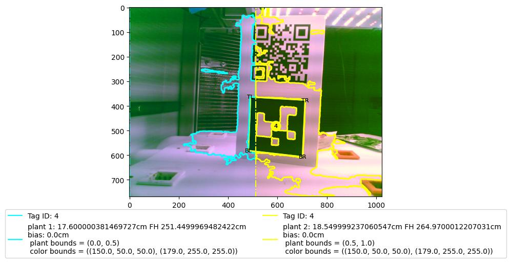
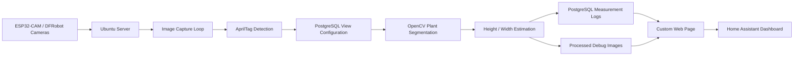

# Automated Greenhouse Monitoring System

A computer vision and data logging system built for a CSU senior design greenhouse project. The system monitors plant growth across a 54-plant hydroponic greenhouse using ESP32-CAM and DFRobot cameras, OpenCV image processing, AprilTag reference markers, PostgreSQL time-series storage, a custom web page, and Home Assistant integration.

The goal was to reduce manual plant measurement by automatically estimating plant height from camera images and making growth data easier to view over time.



<!-- Recommended: add your custom webpage screenshot here before pinning the repo. Example:

-->

## Recruiter Snapshot

- **Project type:** Computer vision, IoT, backend data logging, greenhouse automation
- **Built for:** CSU senior design greenhouse project
- **Scale:** 54 plants monitored with 8 cameras
- **Hardware:** ESP32-CAM modules and DFRobot cameras
- **Deployment:** Continuously ran on an Ubuntu server
- **Interfaces:** Custom web page and Home Assistant dashboard
- **Accuracy:** Validated against manual measurements, with measured errors within approximately 1 cm
- **Main challenge:** Handling variable lighting and tuning HSV color thresholds for reliable plant segmentation

## Why This Project Matters

Manual plant measurements are slow, inconsistent, and difficult to scale when monitoring dozens of plants over time. This project turns greenhouse images into structured growth data by combining camera capture, computer vision, physical reference markers, database-backed configuration, and web-accessible monitoring.

This project is valuable because it shows software working across real system boundaries: cameras, image-processing algorithms, PostgreSQL, Linux deployment, web display, and a physical greenhouse environment.

## What the System Does

- Captures images from configured greenhouse cameras
- Detects AprilTag reference markers with known real-world dimensions
- Uses OpenCV and HSV thresholding to isolate plant pixels
- Estimates plant height and width from camera images
- Stores measurements and image paths in PostgreSQL
- Generates processed debug images for validating the computer vision pipeline
- Displays plant images and growth data through a custom webpage and Home Assistant
- Includes pytest-based tests for important image-processing utilities
- Uses GitHub Actions for automated testing

## Tech Stack

| Area | Tools / Technologies |
|---|---|
| Language | Python |
| Computer Vision | OpenCV, NumPy, AprilTag detection |
| Data Storage | PostgreSQL, psycopg2 |
| Visualization | Matplotlib, pandas |
| Testing | pytest, pytest-cov |
| Deployment | Ubuntu Server, Bash scripts |
| Automation | GitHub Actions |
| Hardware / IoT | ESP32-CAM, DFRobot cameras, greenhouse camera network |
| Dashboard | Custom webpage, Home Assistant |

## Architecture Overview



## How Measurement Works

### 1. Camera image capture

The server collects images from greenhouse cameras. Each camera can contain multiple plants, so the database stores view information that tells the processing pipeline which region of the image belongs to each plant.

### 2. AprilTag reference scaling

Each camera view includes AprilTag markers with known physical dimensions. The image-processing pipeline detects the tag corners and uses the tag size to convert pixel distances into real-world measurements.

### 3. Database-backed plant views

Rather than hardcoding every plant location, the system stores plant view configuration in PostgreSQL. Each view can define:

- Plant ID
- Tag ID
- View type, such as height or width
- Image bounds for that plant
- HSV color bounds
- Minimum blob area thresholds
- Height bias values

This makes the system easier to tune for different plants, camera positions, and lighting conditions.

### 4. Plant segmentation

The system uses HSV color thresholding to identify plant pixels. It then filters blobs, removes noise, and generates debug images so the segmentation results can be visually inspected.

The hardest part of the project was making this work reliably under changing lighting conditions. Small changes in shadows, camera exposure, and leaf color could affect detection, so HSV tuning and debug visualizations became an important part of the workflow.

### 5. Height and width estimation

For height estimation, the pipeline finds the highest valid plant pixel within the configured plant region and compares it against the AprilTag scale. Width estimation works similarly by identifying leftmost and rightmost plant pixels.

### 6. Storage and dashboard display

Measurements, timestamps, raw image paths, and processed image paths are stored in PostgreSQL. The resulting images and growth information are made available through a custom webpage and embedded into Home Assistant for easier monitoring.

## Results

- Monitored **54 plants** using **8 cameras**
- Ran continuously on an **Ubuntu server**
- Integrated camera capture, image processing, database logging, and web display
- Validated automated measurements against manual measurements
- Achieved measurement errors within approximately **1 cm** during validation
- Created processed debug images to make the system easier to test, tune, and explain

## Repository Structure

```text
.
├── analysis/                  # Offline image processing and graphing utilities
├── database/                  # PostgreSQL schema and database helper functions
├── plant_requests/            # Main computer vision request pipeline
│   ├── area_request/           # Future area-estimation module
│   ├── height_request/         # Height estimation logic
│   ├── requestor/              # Runtime image capture and processing loop
│   ├── utils/                  # Image, graph, line, plant, and AprilTag utilities
│   └── width_request/          # Width estimation logic
├── run/                       # Database initialization/reset scripts
├── tests/                     # pytest test suite and sample image tests
├── .github/workflows/          # GitHub Actions CI workflow
├── requirements.txt            # Python dependencies
├── run.sh                      # Starts the image request loop
└── test.sh                     # Resets test database and runs tests
```

## Database Overview

The PostgreSQL schema stores camera metadata, plant records, species information, AprilTag references, plant-specific camera views, and measurement logs.

| Table | Purpose |
|---|---|
| `species` | Stores plant species names and HSV color bounds |
| `camera` | Stores camera IP addresses and optical metadata |
| `plant` | Stores plant records and species relationships |
| `tag` | Stores AprilTag IDs and real-world tag scale |
| `view` | Maps plants to image regions, tags, and request types |
| `height_view` | Stores height-specific configuration |
| `width_view` | Stores width-specific configuration |
| `height_log` | Stores plant height measurements over time |
| `width_log` | Stores plant width measurements over time |

## Setup

### 1. Clone the repository

```bash
git clone <your-repo-url>
cd Server
```

### 2. Create a virtual environment

```bash
python3 -m venv .venv
source .venv/bin/activate
```

### 3. Install dependencies

```bash
pip install --upgrade pip
pip install -r requirements.txt
```

### 4. Configure PostgreSQL

Create and initialize a local test database:

```bash
bash run/reset_test_db.sh
```

The database schema is located in:

```text
database/init.sql
```

For deployment, database credentials should be configured outside of version control through environment variables or a local secrets file.

### 5. Run tests

```bash
python -m pytest -q
```

Or run the project test script:

```bash
bash test.sh
```

### 6. Run the greenhouse request loop

```bash
bash run.sh
```

The runtime version expects access to the configured greenhouse cameras, PostgreSQL database, and image output directories on the Ubuntu server.

## Testing

The test suite focuses on the core image-processing behavior:

- AprilTag detection
- Reference tag scanning
- Plant color segmentation
- Height estimation
- Width estimation
- Utility functions for image and line calculations

GitHub Actions runs the automated tests to help catch regressions when the image-processing or database code changes.

## What WE Learned

This project taught us how to build software that interacts with real hardware and imperfect physical environments. The most important lesson was that the algorithm is only one part of the system. Camera placement, lighting, database design, debug tooling, and deployment reliability all affect whether the software is useful.

Key takeaways:

- Computer vision systems need strong debug visualizations because failures are often visual and environment-dependent
- HSV thresholding can work well, but lighting changes make calibration and tuning critical
- AprilTags are useful for turning camera images into real-world measurements
- Storing plant-specific configuration in a database makes the system more flexible than hardcoding camera regions
- A good monitoring system needs both backend data logging and a simple way for users to view results
- Testing with real images is more valuable than testing only isolated helper functions

## Future Improvements

- Add the final custom web dashboard screenshot and a short demo GIF
- Move all deployment paths and credentials into environment-based configuration
- Add a Docker Compose setup for PostgreSQL and local development
- Improve the dashboard with plant-specific growth charts and camera health status
- Add automatic lighting normalization to reduce HSV retuning
- Expand the unfinished area-estimation module to estimate plant canopy size
- Package the image-processing pipeline as a cleaner Python module
- Add more detailed accuracy reports comparing automated and manual measurements over time

## Maintainers

**Tyler Carver** AUGUST 2025 - MAY 2026 
Computer Science and Computer Engineering  
Interested in embedded software, backend systems, computer vision, automation, and software that interacts with physical hardware.

**Kai Brennan** JANUARY 2026 - CURRENT
